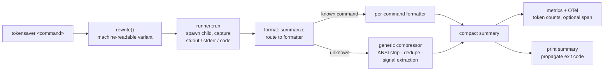

# tokensaver


A tiny CLI proxy that runs another command and prints an **extremely compact**
summary of its output — no AI, no network, just deterministic parsing and
heuristic compression. Typical output is 60–90% smaller than the original.

```text
$ tokensaver git status
* master...origin/master
~ 3  index.html, src/main.rs, src/config.rs
? 2  .fastembed_cache/, tests/
```

…instead of the full multi-line `git status` text.

## Project health

- Community docs: [Code of Conduct](CODE_OF_CONDUCT.md), [Contributing](CONTRIBUTING.md), [Security](SECURITY.md), [Support](SUPPORT.md)
- Changelog: [CHANGELOG.md](CHANGELOG.md)
- Documentation website source: [`docs/`](docs/)
- Documentation website (GitHub Pages): `https://congiuluc.github.io/TokenSaver/`

## Contents

- [Description](#description) — the two-layer summarization model
- [How it works](#how-it-works) — pipeline, source layout, and formatter reference
- [Installation](#installation)
- [Usage](#usage)
- [Integrate with GitHub Copilot](#integrate-with-github-copilot)
- [Token accounting](#token-accounting)
- [OpenTelemetry export](#opentelemetry-export)
- [Development](#development)

## Description

`tokensaver <command> [args...]` executes the command exactly as given, captures its
output, and then renders a compact summary. It works in two layers:

1. **Per-command formatters** — purpose-built parsers that know the structure of
   specific commands and emit a dense, readable summary. Supported today:
   - `git` — `status`, `log`, `diff`, `branch`
   - `cargo` — `build` / `check`, `test`
   - `dotnet` — `build` / `publish` / `pack`, `test`, `restore`
   - `mvn` / `gradle` (including `./mvnw`, `./gradlew`)
   - `go` — `build` / `vet` / `install`, `test`
   - `tsc`, `eslint`, `jest`, `vitest` (including `npx`-wrapped invocations)
   - `docker ps`
   - `kubectl get`
   - `npm install` / `ci`, `yarn` / `pnpm` / `bun` installs
   - `pip` / `pip3` install/uninstall, `poetry` install/add/update
   - `az`, `azd`, `gh`, `copilot`
   - `pytest` (including `python -m pytest`)
2. **Generic signal-aware heuristics** — for every other command (PowerShell
   scripts, build tools, arbitrary executables) the output is cleaned of ANSI
   escape codes, blank-line runs are collapsed, and consecutive duplicate lines
   are folded into a single line with a `(xN)` counter. If the result still fits
   in a small budget it is passed through unchanged; otherwise `tokensaver` switches
   to **signal extraction**:

   - Lines that look like **errors** (`error`, `fatal`, `panic`, `exception`,
     `traceback`, `failed`, `denied`, `not found`, `✗`, …), **warnings**
     (`warning`, `warn:`, `deprecated`, …), or **summaries** (`N passed`,
     `tests`, `files changed`, `vulnerabilit…`, `added/removed`, `success`, …)
     are surfaced first.
   - When notable lines exist, only those are shown (capped), followed by a
     stats footer such as `Σ 202 lines · 4 err · 7 warn`.
   - When nothing stands out, a tight head/tail excerpt is shown with a
     `… N lines omitted …` marker plus the same footer.

   This keeps the signal (what broke, what changed) while discarding the noise,
   which is where the largest token savings come from on chatty commands.

The compression budgets live as constants at the top of
[`src/format/generic.rs`](src/format/generic.rs) and can be tuned:

| Constant     | Default | Meaning                                              |
| ------------ | ------- | ---------------------------------------------------- |
| `MAX_LINES`  | `24`    | Output at or below this many lines is passed through |
| `TAIL_LINES` | `6`     | Lines kept from the end in a head/tail excerpt       |
| `MAX_SIGNAL` | `16`    | Max notable (error/warning/summary) lines surfaced   |

Pass `-x` / `--extreme` for an even tighter pass on unrecognized commands:
output longer than `6` lines collapses to just the error lines (capped at `5`)
plus the stats footer, discarding everything else. Recognized commands (git,
cargo, dotnet, mvn, gradle, go, tsc, eslint, jest, vitest, docker, kubectl, npm,
yarn, pnpm, bun, pip, poetry, az, azd, gh, copilot,
pytest) already produce minimal output and are unaffected by the flag.

A few commands are transparently rewritten to a machine-readable variant for
reliable parsing (e.g. `git status` runs `git status --porcelain=v1 --branch`
under the hood). Use `--raw` to bypass all of this.

The original command's exit code is always propagated, so `tokensaver` is safe to use
in scripts and pipelines.

## How it works

### Pipeline

Every `tokensaver <command>` invocation flows through the same dependency-free
pipeline. Nothing is sent over the network (telemetry excepted, and only when you
opt in), and the child process sees exactly the command you typed.



1. **`rewrite()`** swaps in a parseable variant for a few commands (for example
   `git status` → `git status --porcelain=v1 --branch`). Everything else runs verbatim.
2. **`runner::run`** spawns the child, capturing stdout, stderr, and the exit code
   into an [`Outcome`](src/runner.rs). On Windows, `.cmd`/`.bat` shims resolve through
   the normal `PATH`/`PATHEXT` lookup.
3. **`format::summarize`** normalizes the command to a base name (so `./gradlew`,
   `gradlew.bat`, and `/usr/bin/dotnet` all match), then dispatches to the most
   specific formatter, falling back to the generic compressor.
4. **Accounting** records token counts to `~/.tokensaver/metrics.jsonl` and, when
   enabled, emits an OpenTelemetry span. Both are best-effort and never fail the command.
5. The summary is printed and the **child's exit code is propagated** unchanged.

### Source layout

| Path | Responsibility |
| ---- | -------------- |
| [`src/main.rs`](src/main.rs) | CLI entry: argument parsing and subcommand dispatch (`run`, `--raw`, `--stdin`, `init`, `uninit`, `hook`, `gain`, `tokens`, `context`). |
| [`src/runner.rs`](src/runner.rs) | Spawns the child process and captures stdout / stderr / exit code into `Outcome`. |
| [`src/format/mod.rs`](src/format/mod.rs) | Routing layer: `rewrite()`, `summarize()`, `summarize_text()`, base-name normalization, and the unknown-command `other()` fallback. |
| [`src/format/generic.rs`](src/format/generic.rs) | The heuristic compressor: ANSI stripping, blank-run collapsing, duplicate folding, signal extraction, head/tail excerpts, and the tunable budgets. |
| [`src/format/git.rs`](src/format/git.rs) | `git` formatters for `status`, `log`, `diff`, `branch`. |
| [`src/format/cargo.rs`](src/format/cargo.rs) | `cargo build`/`check` and `cargo test`. |
| [`src/format/dotnet.rs`](src/format/dotnet.rs) | `dotnet build`/`publish`/`pack`/`msbuild`, `test`, `restore`. |
| [`src/format/java.rs`](src/format/java.rs) | Maven (`mvn`/`mvnw`) and Gradle (`gradle`/`gradlew`). |
| [`src/format/golang.rs`](src/format/golang.rs) | `go build`/`vet`/`install` and `go test`. |
| [`src/format/ts.rs`](src/format/ts.rs) | TypeScript `tsc` and `eslint`. |
| [`src/format/jstest.rs`](src/format/jstest.rs) | Jest and Vitest test runners. |
| [`src/format/py.rs`](src/format/py.rs) | `pytest` (including `python -m pytest`). |
| [`src/format/node.rs`](src/format/node.rs) | `npm install`/`ci`. |
| [`src/format/pkg.rs`](src/format/pkg.rs) | `pip`/`pip3`, `poetry`, and the Yarn / pnpm / Bun installers. |
| [`src/format/cloud.rs`](src/format/cloud.rs) | `az`, `azd`, `gh`, and `copilot` CLIs. |
| [`src/format/container.rs`](src/format/container.rs) | `docker ps` and `kubectl get`. |
| [`src/format/table.rs`](src/format/table.rs) | Shared helpers for compacting tabular output. |
| [`src/tokenizer.rs`](src/tokenizer.rs) | Token-counting backends (`gpt5`, `o200k`, `cl100k`, `heuristic`). |
| [`src/metrics.rs`](src/metrics.rs) | JSONL gain logging and the `tokensaver gain` report. |
| [`src/optimize.rs`](src/optimize.rs) | The `tokensaver optimize` text compactor (preview + apply, token-diff summary). |
| [`src/assess.rs`](src/assess.rs) | The `tokensaver context` Copilot context inventory (parallel scan, token accounting, Markdown/JSON export). |
| [`src/otel.rs`](src/otel.rs) | Optional OpenTelemetry / OTLP span export. |
| [`src/init.rs`](src/init.rs) | `init` / `uninit` for Copilot instructions, `AGENTS.md`, and hooks. |
| [`src/hook.rs`](src/hook.rs) | The `tokensaver hook` `postToolUse` handler. |
| [`tests/cli.rs`](tests/cli.rs) | End-to-end CLI integration tests. |

### Formatter reference

Each formatter parses the structure it knows and emits a dense line-oriented
summary; successful states are marked `✓` and failures `✗`. Long lists are
capped with a `… N more` marker. Anything a formatter cannot recognize falls
back to the generic compressor, so output is never lost.

| Command | Routed subcommands | What the summary surfaces |
| ------- | ------------------ | ------------------------- |
| `git` | `status`, `log`, `diff`, `branch` | Branch + ahead/behind, staged/unstaged/untracked file counts, condensed log, diff stat, branch list. |
| `cargo` | `build` / `b`, `check` / `c`, `test` / `t` | Compiler error/warning counts with messages; test pass/fail totals. |
| `dotnet` | `build` / `publish` / `pack` / `msbuild`, `test`, `restore` | MSBuild diagnostics + warning/error footer; VSTest pass/fail with failing names; restore project count. |
| `mvn`, `mvnw` | all | `BUILD SUCCESS`/`FAILURE`, Surefire `Tests run:` totals, `[ERROR]` lines. |
| `gradle`, `gradlew` | all | `BUILD SUCCESSFUL`/`FAILED`, failed tasks and failed tests. |
| `go` | `build` / `vet` / `install`, `test` | Compile diagnostics; `--- FAIL` test names + ok-package count. |
| `tsc` | all | `error TSxxxx` diagnostics + `Found N errors` footer. |
| `eslint` | all | Stylish `✖ N problems` summary + the error problem lines. |
| `jest`, `vitest` | all (incl. `npm test` sniffing) | `Tests:` summary line + failing test names. |
| `pytest` | all (incl. `python -m pytest`) | passed/failed/error counts + failing node IDs. |
| `npm` | `install` / `i` / `ci` | added/removed/changed package counts + vulnerabilities. |
| `yarn`, `pnpm`, `bun` | `install`, `add` (bare `yarn`/`pnpm`) | Highlight lines (`Done in`, `success`, `up to date`) + exit code on failure. |
| `pip`, `pip3` | `install`, `uninstall` | `Successfully installed/uninstalled` lines + errors, dropping progress noise. |
| `poetry` | `install`, `add`, `update`, `remove` | `Package operations:` summary (or bullet counts) + errors. |
| `docker` | `ps` | One compact row per container (name, image, status). |
| `kubectl` | `get` | Compacted table rows. |
| `az` | all | `ERROR:` lines, otherwise a compressed JSON / table excerpt. |
| `azd` | all | Step results (`(✓) Done:` / `(x) Failed:`), endpoints, final `SUCCESS:`/`ERROR:`. |
| `gh` | all | Compressed list / table output; errors fall back to generic. |
| `copilot` | all | Compressed output; errors fall back to generic. |

> Indirect invocations are detected too: `npx eslint`, `node_modules/.bin/jest`,
> and runner output from `npm test` / `yarn test` are routed to the right
> formatter even though the tool name is wrapped or absent from the arguments.
> For `yarn`/`pnpm`/`bun`, only install-like subcommands are treated as installs,
> so `yarn test` still flows to the Jest/Vitest detection.

## Installation

`tokensaver` runs on **Windows, Linux, and macOS** (x86_64 and arm64). Pick the
option that suits you — prebuilt binaries (no toolchain required), `cargo install`,
or building from source.

### Quick install (prebuilt binaries)

These one-liners download the right prebuilt archive for your platform from the
[latest GitHub release](https://github.com/congiuluc/TokenSaver/releases/latest),
verify its checksum, and install the `tokensaver` and `ts` binaries onto your `PATH`.

**Linux / macOS** (installs to `~/.local/bin`):

```sh
curl -fsSL https://raw.githubusercontent.com/congiuluc/TokenSaver/main/install.sh | sh
```

**Windows** (PowerShell; installs to `%LOCALAPPDATA%\Programs\tokensaver`):

```powershell
irm https://raw.githubusercontent.com/congiuluc/TokenSaver/main/install.ps1 | iex
```

To pin a specific version, set the version before running the installer:

```sh
# Linux / macOS
TOKENSAVER_VERSION=v0.1.0 curl -fsSL https://raw.githubusercontent.com/congiuluc/TokenSaver/main/install.sh | sh
```

```powershell
# Windows
$env:TOKENSAVER_VERSION = "v0.1.0"; irm https://raw.githubusercontent.com/congiuluc/TokenSaver/main/install.ps1 | iex
```

> Prefer to inspect scripts before running them? Download
> [`install.sh`](install.sh) / [`install.ps1`](install.ps1), review, then run locally.

### Install with Cargo

If you have the [Rust toolchain](https://rustup.rs/), install straight from the
repository (works on every platform):

```sh
cargo install --git https://github.com/congiuluc/TokenSaver
```

This builds and copies the `tokensaver` and `ts` binaries into your Cargo bin
directory (`~/.cargo/bin`), which `rustup` already puts on your `PATH`.

### Build from source

```sh
# From the project root (the folder containing Cargo.toml)
cargo build --release
```

This uses the size-optimized release profile (`opt-level="z"`, `lto`, `strip`)
and produces small standalone executables at:

```text
target/release/tokensaver(.exe)   # main binary
target/release/ts(.exe)           # short alias
```

The `.exe` suffix is added on Windows only. For a faster, unoptimized debug
build, omit `--release` (output lands in `target/debug/`).

Then copy the binary somewhere on your `PATH`:

```sh
# Linux / macOS
install -m 0755 target/release/tokensaver ~/.local/bin/
install -m 0755 target/release/ts ~/.local/bin/
```

```powershell
# Windows (PowerShell)
Copy-Item target\release\tokensaver.exe, target\release\ts.exe "$env:USERPROFILE\.cargo\bin\"
```

### Verify the install

```sh
tokensaver --help
```

## Usage

```text
tokensaver <command> [args...]      Run and print a compact summary
tokensaver -x | --extreme <cmd>     Run and print a maximally compressed summary
tokensaver --raw <command> ...      Run and print raw output (no summary)
tokensaver - | --stdin              Read stdin and print its compact form
tokensaver init [--global|--cli]    Register tokensaver with GitHub Copilot
tokensaver init --hook [--global]   Install a Copilot postToolUse hook
tokensaver uninit [--global|--cli]  Remove what tokensaver init configured
tokensaver uninit --hook [--global] Remove the Copilot postToolUse hook
tokensaver hook                     Run as a Copilot postToolUse hook (reads stdin)
tokensaver gain                     Show logged token savings
tokensaver gain --reset             Reset logged token savings
tokensaver tokens --prompt <text>   Count words for inline prompt text
tokensaver tokens --file <path>     Count words for file content
tokensaver tokens --stdin           Read stdin and count words
tokensaver optimize --file <path>   Compact a file's text + report token savings
tokensaver context [category]       Inventory Copilot context objects + token cost
tokensaver -h | --help              Show help
```

### Optimize a file's text (`optimize`)

`tokensaver optimize` losslessly compacts the *text* of a file to cut its token
cost. The transformation is deterministic and meaning-preserving (no model
calls): it normalizes line endings, strips trailing whitespace, collapses
repeated inner whitespace (keeping leading indentation) and runs of blank lines,
and trims leading/trailing blank lines.

With `--preview` it prints the optimized text plus a before/after token summary
and **writes nothing** — re-run without `--preview` to apply the change in place
(or send it elsewhere with `--out`). Applied optimizations are recorded so they
show up in `tokensaver gain`.

```text
tokensaver optimize --file <path>           Rewrite the file in place, print savings
tokensaver optimize --file <path> --preview Show optimized text + token diff (no write)
tokensaver optimize --file <path> --out <p> Write the optimized text to another path
tokensaver optimize --stdin                 Read stdin, emit optimized text to stdout
tokensaver optimize --prompt "<text>"       Optimize inline text
tokensaver optimize --file <path> --json    Emit machine-readable JSON
```

The summary reports the active tokenizer, before/after token counts, tokens
saved (with percentage), character counts and line counts.

### Inventory Copilot context (`context`)

`tokensaver context` walks the current workspace **and** your whole device to find
the GitHub Copilot context objects the agent can load — custom instructions
(`copilot-instructions.md`, `AGENTS.md`, `*.instructions.md`), prompt files
(`*.prompt.md`), agents / chat modes (`*.agent.md`, `*.chatmode.md`), skills
(`SKILL.md`) and MCP tool configs (`mcp.json`) — and estimates the token cost of
each, grouped by category.

It distinguishes **always-on** cost (content loaded into every request, such as
broad instruction files and MCP configs) from **on-demand** cost (skills, prompts
and agents only contribute their description to the always-on menu; their body
loads when invoked). Agent / chat-mode files are annotated with the number of
tools they declare in frontmatter, and MCP configs with their server count. The
device-wide scan runs in parallel across all available cores and prints progress
to stderr.

```text
tokensaver context                  Inventory workspace + device
tokensaver context agents           Limit to one category (also: -c/--category)
tokensaver context --workspace      Scan only the current workspace (-w)
tokensaver context --user           Scan only user/device locations (-u)
tokensaver context --top N          Show the N largest consumers (default 5)
tokensaver context --window N       Context window used for budget % (default 128000)
tokensaver context --md <file>      Export the report to a Markdown file (-o/--out)
tokensaver context --json           Emit machine-readable JSON
tokensaver context --quiet          Suppress progress messages (-q)
```

Categories accept singular or plural, case-insensitively: `instructions`,
`prompts`, `agents` (or `chatmode`), `skills`, `tools` (or `mcp`).


### Examples

```powershell
tokensaver git status
tokensaver git log
tokensaver git diff
tokensaver cargo test
tokensaver docker ps
tokensaver kubectl get pods
tokensaver npm install
tokensaver python -m pytest
tokensaver ./build.ps1            # unknown command -> generic compression
tokensaver -x ./build.ps1         # extreme mode -> errors + stats footer only
Get-Content big.log | tokensaver -   # summarize piped text (e.g. before pasting into a prompt)
tokensaver tokens --prompt "Summarize this error log"
tokensaver tokens --file README.md
Get-Content build.log | tokensaver tokens --stdin
```

## Integrate with GitHub Copilot

`tokensaver init` registers `tokensaver` with GitHub Copilot by writing a small managed
block into a [`copilot-instructions.md`](https://docs.github.com/en/copilot/how-tos/configure-custom-instructions/add-repository-instructions)
file. Copilot prepends that file to every request, so the agent learns to prefix
shell commands with `tokensaver` — routing tool/prompt commands through
tokensaver and cutting token usage automatically.

```powershell
tokensaver init             # workspace scope -> .github/copilot-instructions.md
tokensaver init --global    # all workspaces -> ~/.copilot/copilot-instructions.md
tokensaver init --cli       # Copilot CLI / agents -> ./AGENTS.md
```

The `.github/copilot-instructions.md` file is read by both Copilot in the editor
and the Copilot CLI. `--cli` (alias `--agents`) instead writes the repo-root
`AGENTS.md` agent file, the cross-tool format the Copilot CLI and other agents
pick up. The block is delimited by `<!-- tokensaver-instructions v1 -->` markers, so
re-running `tokensaver init` refreshes it in place without touching the rest of the
file. Reload the Copilot window (or start a new chat / CLI session) afterwards so
the updated instructions are picked up.

### Automatic compression with a hook

The instruction block only *asks* the agent to type `tokensaver`. For deterministic,
automatic compression — no model cooperation required — install a Copilot
[`postToolUse` hook](https://docs.github.com/en/copilot/reference/copilot-cli-reference/cli-hooks-reference).
Copilot runs the hook after every tool and lets it replace the tool's result, so
shell output is compressed before the model ever sees it.

```powershell
tokensaver init --hook            # repo scope  -> .github/hooks/tokensaver.json
tokensaver init --hook --global   # all repos    -> ~/.copilot/hooks/tokensaver.json
```

This registers `tokensaver hook` as the handler. Because `postToolUse` fires after
*every* tool and has no `matcher`, `tokensaver hook` itself only rewrites results from
the `bash` and `powershell` tools, and only when compression actually shrinks the
output — otherwise it returns `{}` and Copilot keeps the original result. The
hook reads the payload on stdin and emits a `modifiedResult` JSON object, so it
is never run by hand. Hooks are supported in the Copilot CLI and the Copilot
cloud agent.

### Removing the integration

`tokensaver uninit` reverses `tokensaver init`, taking the same scope flags. It strips only
the managed block (between the `<!-- tokensaver-instructions v1 -->` markers), leaving
any other content in the file untouched; if that leaves the file empty it is
deleted. With `--hook` it removes the generated `tokensaver.json` hook config instead.

```powershell
tokensaver uninit                  # workspace scope -> .github/copilot-instructions.md
tokensaver uninit --global         # all workspaces -> ~/.copilot/copilot-instructions.md
tokensaver uninit --cli            # Copilot CLI / agents -> ./AGENTS.md
tokensaver uninit --hook           # repo hook  -> .github/hooks/tokensaver.json
tokensaver uninit --hook --global  # global hook -> ~/.copilot/hooks/tokensaver.json
```

### Summarizing prompts

Hooks compress tool *output*, not the prompts you type. The `userPromptSubmitted`
hook does fire when you submit a prompt, but its output is not processed — it can
log or audit the prompt, yet cannot rewrite it before it reaches the model. To
shrink a large blob *before* it becomes part of a prompt, pipe it through the
stdin filter and paste the result:

```powershell
Get-Content huge.log | tokensaver -        # condense a log before pasting
somecommand | tokensaver -x -              # extreme compression of piped output
```

### Word counting for prompts or files

Use `tokensaver tokens` when you want word counts (spaces ignored) and a per-line
breakdown without running a command through the summarizer.

```powershell
tokensaver tokens --prompt "Write a concise summary of this deployment error"
tokensaver tokens --file docs/design.md
Get-Content logs/build.log | tokensaver tokens --stdin
```

Example output:

```text
tokensaver — word count
  source:       prompt
  chars:        56
  bytes:        56
  words:        9
  lines:        1
  by line:
    L1: 9
```

## Token accounting

Every tokensaver run (a `tokensaver <command>` run, the stdin filter, or a `tokensaver hook`
compression) is logged so you can see how many tokens it saves.

`TOKENSAVER_TOKENIZER` controls the active token counter used for primary totals:

- `gpt5` (default): OpenAI-style BPE using the `o200k` encoding family
- `o200k`: near-real OpenAI-style BPE (GPT-4o/GPT-5 compatible encoding family)
- `cl100k`: near-real OpenAI-style BPE (GPT-4/3.5 encoding family)
- `heuristic`: deterministic approximation (`ceil(chars/4)`)

PowerShell examples:

```powershell
$env:TOKENSAVER_TOKENIZER = "heuristic"
tokensaver gain

$env:TOKENSAVER_TOKENIZER = "gpt5"
tokensaver git status
tokensaver gain

$env:TOKENSAVER_TOKENIZER = "o200k"
tokensaver cargo test
tokensaver gain
```

Alongside the active totals, tokensaver also records heuristic and model counts
separately so you can compare them directly in `tokensaver gain`.

Records are appended as JSON Lines to `~/.tokensaver/metrics.jsonl` by default. Each
line looks like:

```json
{"ts":1718200000000,"mode":"run","cmd":"git status","tokenizer":"cl100k","modelTokensPresent":1,"rawTokens":420,"outTokens":85,"rawTokensHeuristic":435,"outTokensHeuristic":90,"rawTokensModel":420,"outTokensModel":85,"rawBytes":1680,"outBytes":340}
```

Set the `TOKENSAVER_LOG` environment variable to write somewhere else, or to `off`
(also `0` or empty) to disable logging entirely. Logging never fails a command —
any I/O error while recording is silently ignored.

View the running totals with `tokensaver gain`:

```powershell
tokensaver gain
# tokensaver — token savings
#   tokenizer:    gpt5
#   invocations:  128
#   raw chars:    216840
#   out chars:    39496
#   raw tokens:   54210
#   out tokens:   9874
#   saved:        44336 (81.8%)
#   heuristic raw tokens:   55562
#   heuristic out tokens:   10198
#   heuristic saved:        45364 (81.6%)
#   model raw tokens:       54210 (128 samples)
#   model out tokens:       9874
#   model saved:            44336 (81.8%)

# Reset persisted gain stats
tokensaver gain --reset
# tokensaver: reset gain stats at C:\Users\you\.tokensaver\metrics.jsonl
```

Notes:

- `raw tokens` / `out tokens` / `saved` always reflect the active
  `TOKENSAVER_TOKENIZER` mode.
- `model tokens: n/a` means no model-token records have been logged yet
  (for example, all existing log lines were recorded in `heuristic` mode).
- `(<N> samples)` under model totals counts only records that included model
  tokenization data.

## OpenTelemetry export

In addition to the JSONL gain log, every tokensaver event (a `run`, a `stdin`
filter, or a `hook` compression) can be exported as an OpenTelemetry **span**
describing how much the output shrank. The exporter is dependency-free and built
on `std` only, so it speaks plain HTTP/1.1 and cannot terminate TLS itself —
point it at a local OpenTelemetry Collector/agent for HTTPS upstreams. As with
all accounting, every failure is swallowed so telemetry never affects the command.

Export is **off by default** and has two independent, opt-in sinks:

- **Local file** — appends each span as OTLP JSON (one document per line) to
  `~/.tokensaver/traces.jsonl`.
- **OTLP/HTTP** — POSTs the span as OTLP JSON to `<endpoint>/v1/traces`.

It becomes active when `TOKENSAVER_OTEL` is truthy (anything other than
`off` / `0` / empty) **or** when an OTLP endpoint is configured.

| Variable | Purpose |
| -------- | ------- |
| `TOKENSAVER_OTEL` | Master switch. Truthy enables export; `off` / `0` / empty disables it. |
| `TOKENSAVER_OTEL_FILE` | Override the local trace file path, or set `off` / `0` / empty to disable the file sink. |
| `OTEL_EXPORTER_OTLP_ENDPOINT` | Base OTLP endpoint; the span is sent to `<endpoint>/v1/traces`. Setting this also enables export. |
| `OTEL_EXPORTER_OTLP_TRACES_ENDPOINT` | Traces-specific endpoint override (takes precedence over the base endpoint). |
| `OTEL_SERVICE_NAME` | Service name reported on the span (default `tokensaver`). |

```powershell
# Local file sink only
$env:TOKENSAVER_OTEL = "1"
tokensaver cargo test
Get-Content "$env:USERPROFILE\.tokensaver\traces.jsonl" -Tail 1

# Ship to a local OpenTelemetry Collector (which can forward over TLS)
$env:OTEL_EXPORTER_OTLP_ENDPOINT = "http://localhost:4318"
$env:OTEL_SERVICE_NAME = "tokensaver"
tokensaver git status
```

Each span carries the invocation `mode` (`run` / `stdin` / `hook`), the command
string, raw vs. output token estimates, raw vs. output byte counts, and the
wall-clock duration of the run.

## Development

`tokensaver` is a single Rust crate with **no runtime dependencies** beyond
[`tiktoken-rs`](https://crates.io/crates/tiktoken-rs) (used for near-real token
counting). The release profile is tuned for size (`opt-level = "z"`, `lto`,
`strip`, `panic = "abort"`).

```powershell
cargo build              # debug build -> target\debug\tokensaver.exe
cargo build --release    # size-optimized build -> target\release\tokensaver.exe
cargo test               # run the full suite (unit + CLI integration tests)
cargo fmt                # format
cargo clippy             # lint
```

### Adding a formatter

Formatters follow a consistent pattern, so adding support for a new command is
self-contained:

1. Create `src/format/<name>.rs` with a function per subcommand that takes
   `&Outcome` and returns a `String`. Mark success with `✓` and failure with
   `✗`, cap long lists with a `… N more` line, and fall back to
   `generic::summarize(out)` when the output is unrecognizable.
2. Register the module in [`src/format/mod.rs`](src/format/mod.rs) with
   `pub mod <name>;` (kept alphabetical).
3. Add a dispatch arm in `summarize()` keyed on `(command, subcommand)`. Only
   route the subcommands you actually parse, so unrelated ones still reach the
   generic compressor or the `other()` sniffer.
4. Include a `#[cfg(test)] mod tests` block with `Outcome { stdout, stderr, code }`
   fixtures covering both success and failure paths.

The generic compressor's budgets (`MAX_LINES`, `TAIL_LINES`, `MAX_SIGNAL`) live
as constants at the top of [`src/format/generic.rs`](src/format/generic.rs) and
can be tuned without touching any formatter.

## OpenTelemetry

Every tokensaver run can also be exported as an OpenTelemetry **span**, so you can
track compression in your existing observability stack. Export is built on the
standard library only and is disabled by default.

Enable it by setting `TOKENSAVER_OTEL` to anything other than `off`/`0`/empty, or by
configuring an OTLP endpoint. Two sinks are available, and both can run at once:

- **Local span file** — when OpenTelemetry is enabled, each span is appended as
  an OTLP JSON document (one per line) to `~/.tokensaver/traces.jsonl`. Override the
  path with `TOKENSAVER_OTEL_FILE`, or disable the file with `off`/`0`/empty.
- **OTLP/HTTP** — when `OTEL_EXPORTER_OTLP_ENDPOINT` is set, the span is POSTed
  as OTLP JSON to `<endpoint>/v1/traces`. Use
  `OTEL_EXPORTER_OTLP_TRACES_ENDPOINT` to supply a full traces URL directly.

```powershell
$env:TOKENSAVER_OTEL = "1"
$env:OTEL_EXPORTER_OTLP_ENDPOINT = "http://localhost:4318"
$env:OTEL_SERVICE_NAME = "tokensaver"   # optional; defaults to "tokensaver"
tokensaver git status
```

Each span is named `tokensaver.<mode>` (`run`, `stdin`, or `hook`) and carries
`tokensaver.command`, `tokensaver.raw_tokens`, `tokensaver.out_tokens`, `tokensaver.saved_tokens`,
`tokensaver.raw_bytes` and `tokensaver.out_bytes` attributes.

Because the exporter uses plain HTTP/1.1 (the standard library provides no TLS),
it cannot reach an `https://` ingest directly — point it at a local
OpenTelemetry Collector or agent that terminates TLS upstream. As with metrics
logging, any export error is silently ignored so the primary command is never
affected.

## Project structure

```text
tokensaver/
├── Cargo.toml              # Manifest; size-optimized release profile
├── README.md
├── src/
│   ├── main.rs             # CLI entry: arg parsing, --help/--raw/--extreme, dispatch
│   ├── init.rs             # `tokensaver init`: Copilot instructions + hook integration
│   ├── hook.rs             # `tokensaver hook`: Copilot postToolUse hook adapter
│   ├── metrics.rs          # `tokensaver gain`: token estimation + JSONL logging
│   ├── tokenizer.rs        # heuristic + near-real model token counters
│   ├── otel.rs             # OpenTelemetry OTLP span export (file + HTTP)
│   ├── runner.rs           # Process execution and Outcome { stdout, stderr, code }
│   └── format/
│       ├── mod.rs          # Command rewriting + summarize() dispatch
│       ├── generic.rs      # Signal-aware fallback compression
│       ├── git.rs          # git status/log/diff/branch
│       ├── cargo.rs        # cargo build/check & test
│       ├── container.rs    # docker ps, kubectl get
│       ├── node.rs         # npm install/ci
│       ├── py.rs           # pytest
│       └── table.rs        # column-aligned table parsing helper
└── tests/
    └── cli.rs              # End-to-end tests against the built binary
```

## Testing

```powershell
cargo test
```

The suite covers each per-command formatter, the generic compression heuristics
(ANSI stripping, dedup, head/tail excerpts, signal extraction), command
rewriting, the `tokensaver init` instruction-block merge, the `tokensaver hook` payload
parsing and `modifiedResult` output, heuristic/model token accounting and
metrics aggregation,
and end-to-end binary behavior (usage output, exit-code propagation, `--raw`
passthrough).

## License

MIT
